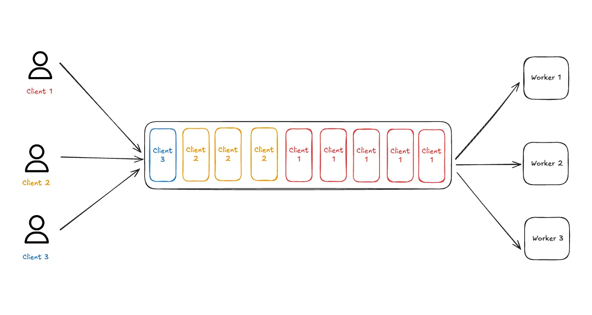
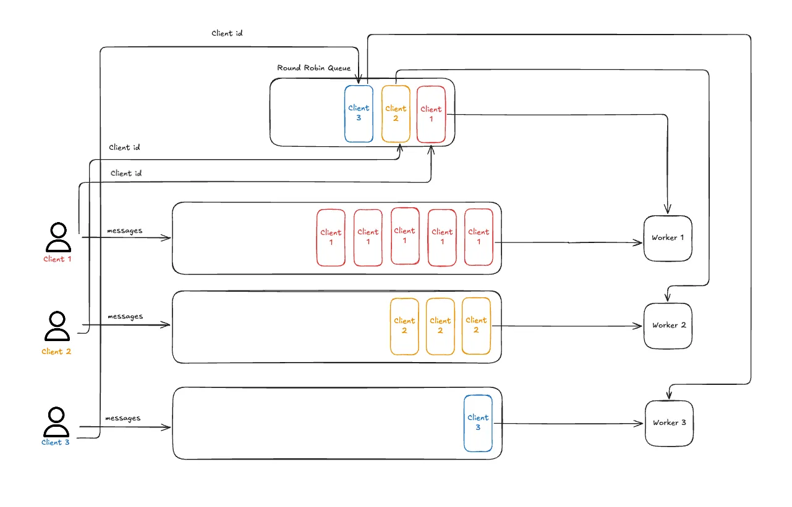

## 引言

在构建多租户系统时，消息队列是一个常见的基础设施组件。然而，传统的 FIFO（先进先出）队列在处理来自多个生产者的消息时，往往无法满足公平性的需求。当一个生产者突然发送大量消息时，其他生产者的少量消息可能会被长时间阻塞，导致系统响应延迟和服务质量下降。

公平队列（Fair Queuing）正是为了解决这个问题而设计的。本文将深入探讨公平队列的概念、实现思路，并提供一个完整的 C# 实现。

## 问题背景：FIFO 队列的局限性

### 传统队列的问题

简单的 FIFO 队列对于多租户系统来说并不可行。实际使用过程中，可能会出现某个生产者突然快速生产大批量数据的情况，导致其他生产者产生的少量数据排在队列的最后面。



**场景示例：**

假设有 3 个客户端同时向队列发送消息：
- 客户端 A：发送 1000 条消息
- 客户端 B：发送 1 条消息
- 客户端 C：发送 1 条消息

在传统的 FIFO 队列中，消息处理顺序为：A1, A2, A3, ..., A1000, B1, C1。这意味着客户端 B 和 C 的消息需要等待所有 1000 条来自客户端 A 的消息处理完毕才能得到服务。

传统队列就像在排着一条大队。每个人都按照到达的顺序得到服务，这听起来很公平，直到有人发送大量消息。

### 公平队列的优势

公平排队则不同。这就像为每个客户设置单独的线路，但有一个接待员轮流从每条线路呼叫一个人。



如果客户 A 有 1,000 条消息，而客户 B 有 1 条消息，则客户 B 不必等待客户 A 的所有 1,000 条消息清除。系统只是在它们之间交替：A、B、C、A、B、C、A、B、C……

这样，每个客户端都能公平地获得处理时间，不会因为某个客户端的消息量过大而影响其他客户端的服务质量。

## 应用场景

公平队列在以下场景中特别有用：

1. **多租户 SaaS 平台**：确保不同租户的请求得到公平处理，避免某个高流量租户影响其他租户
2. **任务调度系统**：多个用户提交任务时，保证每个用户的任务都能及时执行
3. **API 网关**：限制单个客户端的请求速率，防止恶意或异常流量影响其他用户
4. **消息中间件**：在消息队列中实现公平消费，避免某个生产者消息堆积影响其他生产者
5. **数据库连接池**：多个客户端共享连接资源时，公平分配连接

## 实现思路

公平队列的核心思想是为每个客户端维护一个独立的队列，然后使用轮询（Round-Robin）算法从各个客户端队列中交替取出消息进行处理。

### 当消息到达时

1. 我们将消息存储在专用于该特定客户端的队列中
2. 我们检查此客户端的 ID 是否已在我们的轮循调度程序中
   - 如果他们已经在轮换中，我们就完成了
   - 如果他们是新的，我们会将其客户端 ID 添加到轮循机制队列的末尾

### 当处理消息时

1. 我们从轮询调度程序中获取下一个客户端 ID
2. 我们转到该客户端的专用队列并获取他们的一条消息
3. 处理后，我们检查他们是否有更多工作等待
   - 如果他们的队列是空的，会退出轮询
   - 如果他们仍然有消息，我们会将他们的客户 ID 放回队列末尾

## 代码实现

下面是一个使用 C# 实现的公平队列处理器：

```csharp
using System;
using System.Collections.Concurrent;
using System.Collections.Generic;
using System.Threading;

// 测试代码
var client_1 = "client_1";
var client_2 = "client_2";
var client_3 = "client_3";

RoundRobinMessageProcessor mq = new();
mq.InsertMessage(new Message("测试111"), client_1);
mq.InsertMessage(new Message("测试111222"), client_1);
mq.InsertMessage(new Message("测试111333"), client_1);
mq.InsertMessage(new Message("测试222"), client_2);
mq.InsertMessage(new Message("测试222333"), client_2);
mq.InsertMessage(new Message("测试333"), client_3);

Console.WriteLine("开始处理消息（轮询顺序）：");
for (int i = 0; i < 6; i++)
{
    var msg = mq.ProcessMessage();
    Console.WriteLine($"  [{i + 1}] {msg?.Content ?? "null"}");
    Thread.Sleep(1500);
}

/* output
开始处理消息（轮询顺序）：
  [1] 测试111
  [2] 测试222
  [3] 测试333
  [4] 测试111222
  [5] 测试222333
  [6] 测试111333
*/

/// <summary>
/// 消息类
/// </summary>
public class Message
{
    public string Content { get; set; }
    // 可以添加其他属性，如时间戳、优先级等
    public Message(string content)
    {
        Content = content;
    }
}

/// <summary>
/// 轮询消息处理器 - 公平队列实现
/// </summary>
public class RoundRobinMessageProcessor
{
    // 为每个客户端维护一个专用的消息队列
    private readonly ConcurrentDictionary<string, ConcurrentQueue<Message>> _clientQueues;
    // 轮询调度器队列 (FIFO)
    private readonly ConcurrentQueue<string> _roundRobinQueue;
    // 用于跟踪哪些客户端当前在轮询队列中（确保唯一性）
    private readonly HashSet<string> _activeClientsInQueue;

    private readonly object _syncRoot = new object();

    public RoundRobinMessageProcessor()
    {
        _clientQueues = new ConcurrentDictionary<string, ConcurrentQueue<Message>>();
        _roundRobinQueue = new ConcurrentQueue<string>();
        _activeClientsInQueue = new HashSet<string>();
    }

    /// <summary>
    /// 插入消息到指定客户端的队列
    /// </summary>
    /// <param name="message">要插入的消息</param>
    /// <param name="clientId">客户端ID</param>
    public void InsertMessage(Message message, string clientId)
    {
        if (string.IsNullOrEmpty(clientId))
            throw new ArgumentException("Client ID cannot be null or empty.", nameof(clientId));

        if (message == null)
            throw new ArgumentNullException(nameof(message));

        // 客户端专用队列
        var clientQueue = _clientQueues.GetOrAdd(clientId, id => new ConcurrentQueue<Message>());

        // 将消息存入客户端队列
        clientQueue.Enqueue(message);

        // 检查客户端ID是否已在轮询队列中
        lock (_syncRoot)
        {
            if (!_activeClientsInQueue.Contains(clientId))
            {
                _roundRobinQueue.Enqueue(clientId);
                _activeClientsInQueue.Add(clientId);
            }
        }
    }

    /// <summary>
    /// 处理下一条消息
    /// </summary>
    /// <returns>返回处理的消息，如果没有消息则返回null</returns>
    public Message ProcessMessage()
    {
        string clientId = null;

        // 从轮询队列获取客户端ID
        if (!_roundRobinQueue.TryDequeue(out clientId))
        {
            return null;
        }

        lock (_syncRoot)
        {
            _activeClientsInQueue.Remove(clientId);
        }

        // 从该客户端的专用队列中取出消息
        if (_clientQueues.TryGetValue(clientId, out var clientQueue) && clientQueue.TryDequeue(out var message))
        {
            // 检查该客户端队列是否还有更多消息
            if (clientQueue.Count > 0)
            {
                // 如果还有消息，将客户端ID放回轮询队列末尾
                lock (_syncRoot)
                {
                    if (!_activeClientsInQueue.Contains(clientId))
                    {
                        _roundRobinQueue.Enqueue(clientId);
                        _activeClientsInQueue.Add(clientId);
                    }
                }
            }
            return message;
        }

        return null;
    }
}
```

## 性能分析

### 时间复杂度

- **InsertMessage**：O(1)
  - `ConcurrentDictionary.GetOrAdd`：平均 O(1)
  - `ConcurrentQueue.Enqueue`：O(1)
  - `HashSet.Contains`：O(1)
  - `HashSet.Add`：O(1)

- **ProcessMessage**：O(1)
  - `ConcurrentQueue.TryDequeue`：O(1)
  - `HashSet.Remove`：O(1)
  - `ConcurrentDictionary.TryGetValue`：平均 O(1)
  - `ConcurrentQueue.TryDequeue`：O(1)

### 空间复杂度

- O(N + M)，其中 N 是消息总数，M 是客户端数量
- 每个消息存储在对应的客户端队列中
- 每个有消息的客户端在轮询队列中占用一个位置

### 并发性能

- 使用 `ConcurrentDictionary` 和 `ConcurrentQueue` 保证线程安全
- 使用 `lock` 保护 `_activeClientsInQueue` 和 `_roundRobinQueue` 的一致性
- 读写操作可以并发进行，但写入操作会有轻微的锁竞争

## 注意事项

在实际使用中，需要注意以下几点：

1. **内存管理**：如果某个客户端长时间不发送消息，其队列会占用内存。可以考虑添加清理机制，定期清理空闲客户端的队列。

2. **优先级支持**：当前实现不支持优先级。如果需要，可以在 `Message` 类中添加优先级字段，并在处理时进行排序。

3. **消息持久化**：当前实现是内存队列，重启后消息会丢失。对于需要持久化的场景，可以考虑结合数据库或消息队列中间件。

4. **批量处理**：如果需要批量处理消息，可以修改 `ProcessMessage` 方法，一次取出多条消息。

5. **超时机制**：可以添加消息超时机制，避免消息在队列中等待时间过长。

6. **监控指标**：建议添加监控指标，如队列长度、处理延迟、客户端数量等，以便及时发现和解决问题。

7. **异常处理**：在消息处理过程中可能会抛出异常，需要考虑异常处理策略，如重试、记录日志等。

## 总结

公平队列是解决多租户系统中消息处理公平性问题的有效方案。通过为每个客户端维护独立队列并使用轮询算法，可以确保每个客户端都能公平地获得处理时间，避免某个客户端的消息量过大影响其他客户端的服务质量。

本文提供的 C# 实现具有良好的并发性能，时间复杂度为 O(1)，适合在高并发场景中使用。在实际应用中，可以根据具体需求进行扩展，如添加优先级支持、消息持久化、批量处理等功能。

公平队列不仅适用于消息处理场景，还可以应用于任务调度、API 限流、资源分配等多个领域，是构建公平、高效的多租户系统的重要工具。